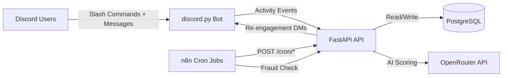

# EngageX

**Intelligent Referral, Task & Engagement Engine for Discord**

[](https://python.org)
[](https://fastapi.tiangolo.com)
[](https://discordpy.readthedocs.io)
[](https://n8n.io)
[](https://postgresql.org)

EngageX is a behavior-driven growth engine for Discord communities. It rewards quality engagement, detects fraud silently, and drives retention through gamification — powered by n8n automation and AI scoring.

---

## Architecture



---

## Features

- **AI Content Scoring** — `/submit` content gets evaluated by AI for originality, effort & engagement potential
- **Streak System** — Daily activity tracking with bonus points and 1.5x multiplier at 7+ day streak
- **Hidden Quests** — Surprise rewards triggered by milestones (first referral, 7-day streak, etc.)
- **Fraud Detection** — Silent flagging for referral spam, bot patterns, and duplicate content; shadow-banned users get reduced rewards without knowing
- **Point Decay** — 2% daily compound decay after 3-day grace period keeps the leaderboard competitive
- **Re-engagement** — Automated nudge DMs to inactive users via n8n cron workflows
- **Reputation Tiers** — Weighted scoring: content > referrals > participation. Fraud = penalty

---

## Screenshots

| Leaderboard | Profile | AI Scoring | Referrals |
|:---:|:---:|:---:|:---:|
|  |  |  |  |

### n8n Automation Workflows

| Streak & Decay Cron (24h) | Fraud Detection (6h) |
|:---:|:---:|
|  |  |

### Railway Infrastructure

| Infrastructure Topology |
|:---:|
|  |

---

## Commands

| Command | Description |
|---------|------------|
| `/points` | Check your points, streak, and tier |
| `/leaderboard` | Top 10 users by points |
| `/profile` | Full profile with stats and recent activity |
| `/tasks` | Available and completed tasks |
| `/referrals` | Your referral stats and quality scores |
| `/submit <content>` | Submit content for AI scoring |

The bot also passively tracks activity — every message updates streaks and logs engagement.

---

## Quick Start

```bash
git clone https://github.com/KaranMakani/EngageX.git
cd EngageX
poetry install
cp .env.example .env   # fill in your keys
poetry run uvicorn app.main:app --reload
```

### Environment Variables

| Variable | Description |
|----------|------------|
| `DISCORD_TOKEN` | Discord bot token |
| `DATABASE_URL` | PostgreSQL connection string (`postgresql+asyncpg://...`) |
| `OPENAI_API_KEY` | OpenAI or OpenRouter API key |
| `OPENAI_BASE_URL` | `https://openrouter.ai/api/v1` for OpenRouter |
| `N8N_WEBHOOK_URL` | Your n8n instance URL |
| `APP_URL` | Your API URL (for n8n callbacks) |

### Infrastructure

1. **PostgreSQL** — Create on Railway, copy the `DATABASE_PUBLIC_URL` into `.env`, change `postgresql://` to `postgresql+asyncpg://`
2. **n8n** — Deploy on Railway, import the workflow JSONs from `app/n8n/`
3. **API on Railway** (optional) — The Dockerfile uses `API_ONLY=1` mode to run FastAPI without the Discord bot

---

## Project Structure

```
EngageX/
├── app/
│   ├── main.py              # FastAPI + Discord bot entry point
│   ├── config.py            # Environment config (pydantic-settings)
│   ├── database.py          # SQLAlchemy async engine
│   ├── models/models.py     # User, Referral, Task, UserTask, ActivityLog
│   ├── routes/api.py        # REST endpoints + n8n webhooks
│   ├── bot/discord_bot.py   # Slash commands + message listeners
│   ├── logic/
│   │   ├── referral.py      # Referral validation + quality scoring
│   │   ├── scoring.py       # AI content scoring (OpenAI/OpenRouter)
│   │   ├── streaks.py       # Daily streak tracking + bonuses
│   │   ├── fraud.py         # Silent fraud detection
│   │   ├── decay.py         # Point decay for inactive users
│   │   ├── quests.py        # Hidden quest engine
│   │   ├── reengage.py      # Re-engagement nudge system
│   │   └── reputation.py    # Weighted reputation + tiers
│   └── n8n/
│       ├── streak_decay_cron.json
│       └── fraud_detection.json
├── tests/test_logic.py      # 27 unit tests
├── Dockerfile
└── pyproject.toml
```

---

## API Endpoints

| Method | Endpoint | Description |
|--------|----------|-------------|
| `GET` | `/api/points/{id}` | User points and streak |
| `GET` | `/api/profile/{id}` | Full user profile |
| `GET` | `/api/leaderboard` | Top users by points |
| `POST` | `/api/user` | Register new user |
| `POST` | `/api/referral` | Process a referral |
| `POST` | `/api/content-score` | Score content with AI |
| `POST` | `/api/cron/streak-reset` | Daily: reset inactive streaks |
| `POST` | `/api/cron/decay` | Daily: apply point decay |
| `POST` | `/api/cron/reengage` | Send re-engagement nudges |
| `POST` | `/api/check-fraud` | Run fraud detection |

---

## Tests

```bash
poetry run pytest tests/ -v
```

27 tests covering scoring, streaks, fraud detection, reputation tiers, and hidden quest conditions.

---

## License

MIT
