# EngageX (Working Title)

**Intelligent Referral, Task & Engagement Engine for Discord Communities**

[](https://python.org)
[](https://fastapi.tiangolo.com)
[](https://discordpy.readthedocs.io)
[](https://n8n.io)
[](https://postgresql.org)
[](https://railway.app)

EngageX is a behavior-driven growth engine for Discord communities. It tracks user actions, rewards quality engagement, detects fraud silently, and drives retention through gamification loops — all powered by n8n automation and AI scoring.

---

## Architecture

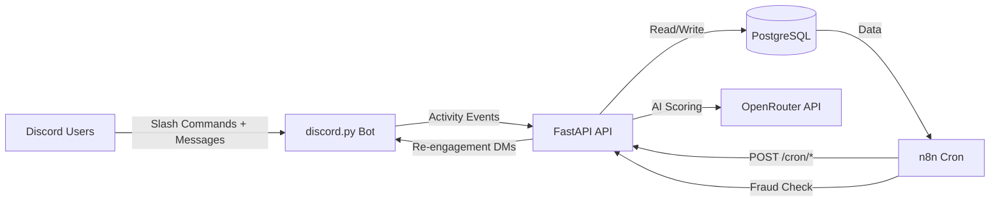

```mermaid
graph TB
    subgraph User-Facing
        A[/points] --> G[Check Stats]
        B[/leaderboard] --> H[Rankings]
        C[/profile] --> I[Full Profile]
        D[/tasks] --> J[Quest Board]
        E[/referrals] --> K[Referral Stats]
        F[/submit] --> L[AI Content Score]
    end

    subgraph Passive Tracking
        M[on_message] --> N[Streak Update]
        O[on_member_join] --> P[Auto-Register]
    end

    subgraph Automation Layer
        Q[24h Cron] --> R[Reset Streaks]
        Q --> S[Apply Decay]
        Q --> T[Re-engage DMs]
        U[6h Cron] --> V[Fraud Detection]
    end
```

---

## How It Works

Instead of the traditional `command → response` bot model, EngageX follows:

```
observe → analyze → decide → act → adapt
```

Every user interaction is logged, analyzed, and used to drive personalized engagement. No manual moderation needed.

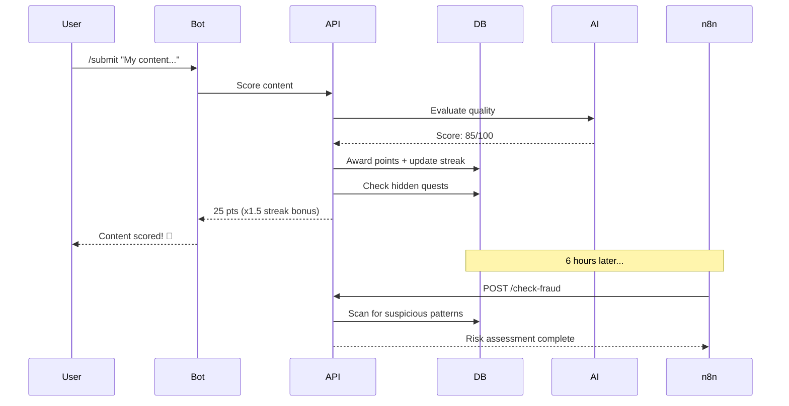

---

## Screenshots

### Discord Bot

| `/leaderboard` | `/profile` |
|:---:|:---:|
| 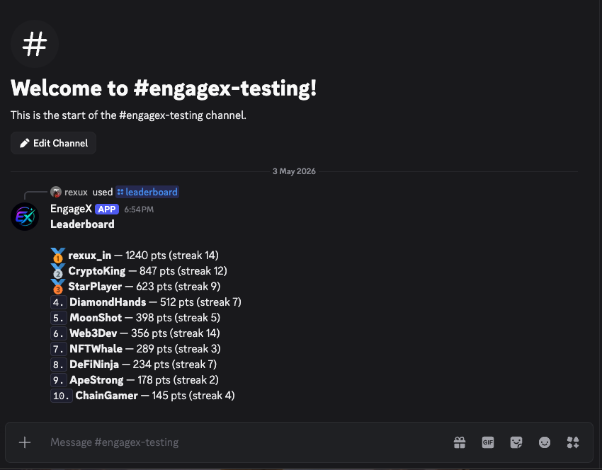 | 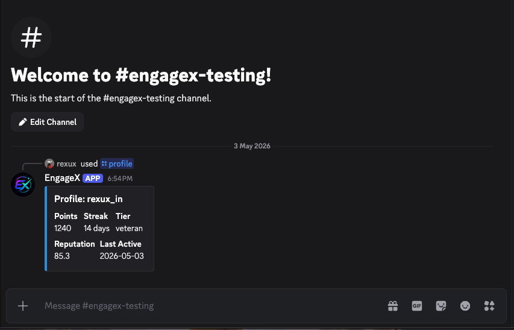 |

| `/points` | `/submit` Result |
|:---:|:---:|
| 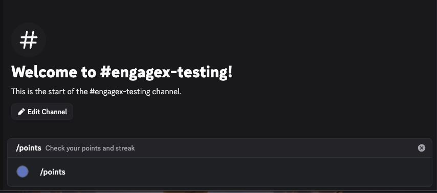 | 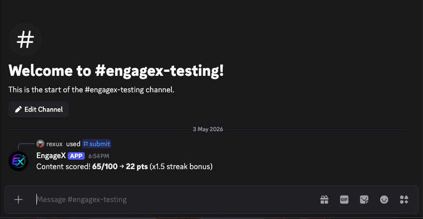 |

| `/referrals` | AI Content Scoring |
|:---:|:---:|
| 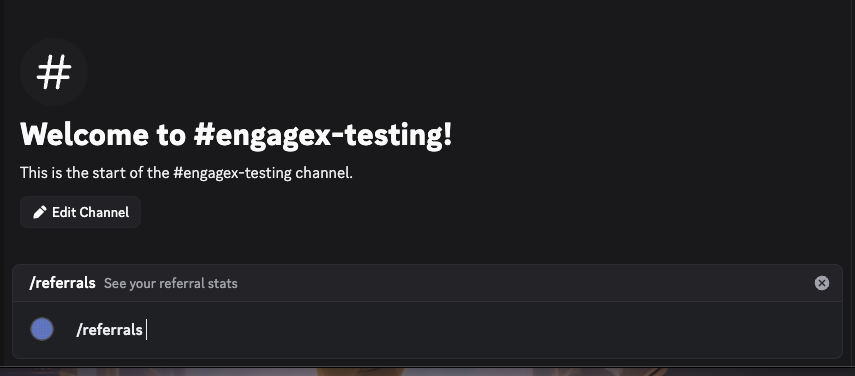 | 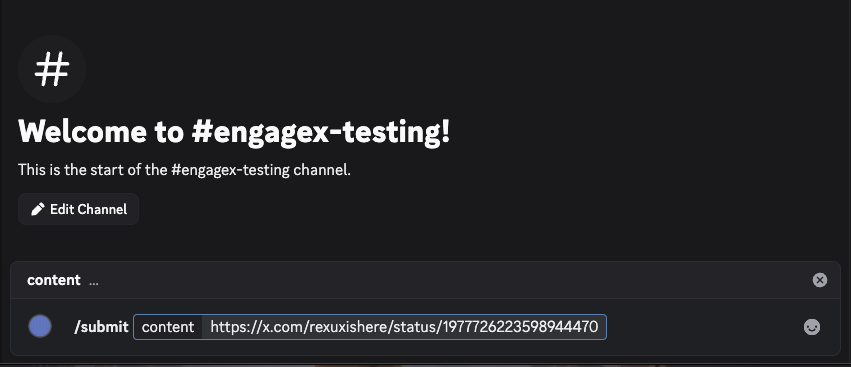 |

### n8n Automation Workflows

| Streak & Decay Cron (24h) | Fraud Detection (6h) |
|:---:|:---:|
| 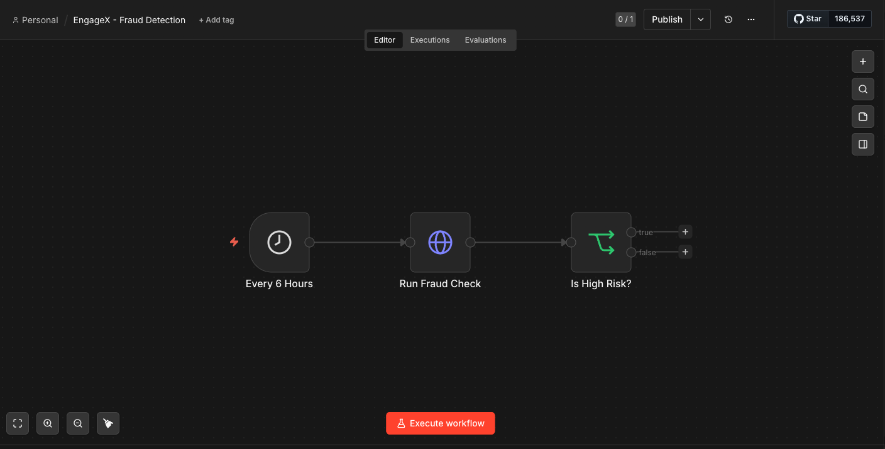 | 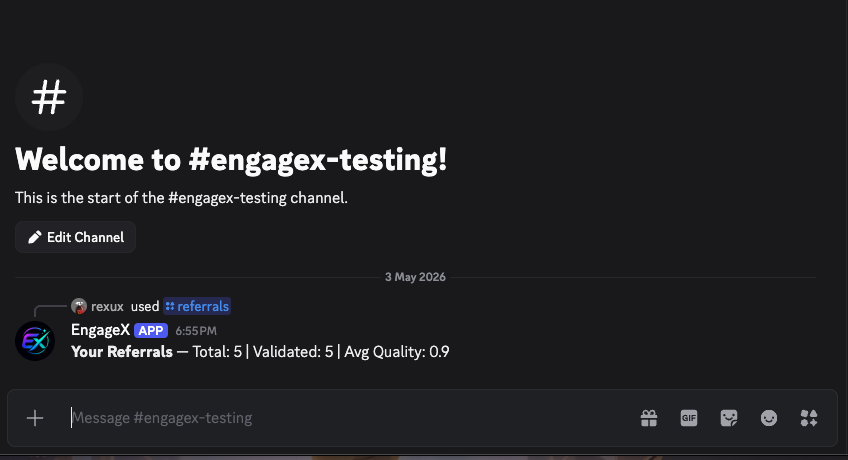 |

### Railway Infrastructure

| Infrastructure Topology |
|:---:|
| 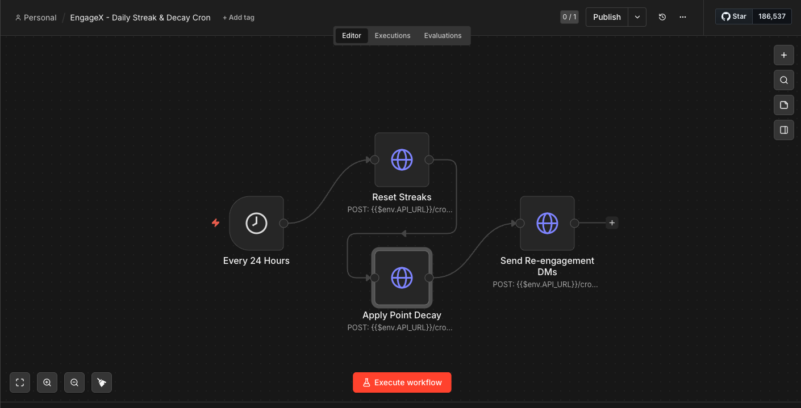 |

---

## Core Modules

| Module | What It Does |
|--------|-------------|
| **Referral Engine** | Validates referrals, scores quality over quantity, rewards only high-quality signups |
| **AI Content Scoring** | Uses OpenAI to evaluate content originality, engagement potential, and effort |
| **Streak System** | Tracks daily activity, rewards consistency with bonus points and multipliers |
| **Fraud Detection** | Silently flags suspicious behavior — referral spam, bot patterns, duplicate content |
| **Hidden Quests** | Surprise rewards triggered by behavior milestones (first referral, 7-day streak, etc.) |
| **Point Decay** | Inactive users lose points over time, keeping the leaderboard competitive |
| **Reputation System** | Weighted scoring — content creation > referrals > participation. Fraud = penalty |
| **Re-engagement Engine** | Automated nudges to inactive users via Discord DMs |

---

## Tech Stack

| Layer | Technology |
|-------|-----------|
| Bot Interface | discord.py |
| API Backend | FastAPI + Uvicorn |
| Automation | n8n (Railway) |
| Database | PostgreSQL (Railway, async via asyncpg) |
| AI Scoring | OpenAI / OpenRouter |
| ORM | SQLAlchemy (async) |
| Package Manager | Poetry |

---

## Data Flow

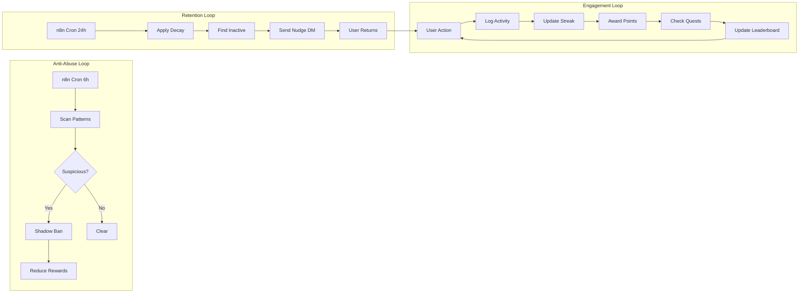

---

## Discord Bot Commands

| Command | Description |
|---------|------------|
| `/points` | Check your points, streak, and tier |
| `/leaderboard` | See the top 10 users |
| `/profile` | Full profile with recent activity |
| `/tasks` | Available tasks and completion status |
| `/referrals` | Your referral stats and quality scores |
| `/submit <content>` | Submit content for AI scoring |

The bot also passively tracks activity — every message updates streaks and logs engagement.

---

## API Endpoints

| Method | Endpoint | Description |
|--------|----------|-------------|
| `GET` | `/api/points/{discord_id}` | Get user points and streak |
| `GET` | `/api/profile/{discord_id}` | Full user profile |
| `GET` | `/api/leaderboard` | Top users by points |
| `GET` | `/api/tasks/{discord_id}` | Available and completed tasks |
| `POST` | `/api/user` | Register new user |
| `POST` | `/api/referral` | Process a referral |
| `POST` | `/api/content-score` | Score content with AI |
| `POST` | `/api/cron/streak-reset` | Daily cron: reset inactive streaks |
| `POST` | `/api/cron/decay` | Daily cron: apply point decay |
| `POST` | `/api/cron/reengage` | Cron: send re-engagement nudges |
| `POST` | `/api/check-fraud` | Run fraud detection on a user |

---

## n8n Workflows

| Workflow | Schedule | What It Does |
|----------|----------|-------------|
| Streak & Decay Cron | Every 24h | Resets streaks for inactive users, applies point decay, sends re-engagement DMs |
| Fraud Detection | Every 6h | Scans for suspicious patterns — referral spam, bot behavior, duplicate content |

Import the JSON files from `app/n8n/` into your n8n instance to activate them.

---

## Project Structure

```
EngageX/
├── app/
│   ├── main.py              # Entry point (FastAPI + Discord bot)
│   ├── config.py            # Environment configuration
│   ├── database.py          # SQLAlchemy async engine + sessions
│   ├── models/
│   │   └── models.py        # User, Referral, Task, UserTask, ActivityLog
│   ├── routes/
│   │   └── api.py           # REST endpoints + n8n webhook receivers
│   ├── bot/
│   │   └── discord_bot.py   # Slash commands + message listeners
│   ├── logic/
│   │   ├── referral.py      # Referral validation + quality scoring
│   │   ├── scoring.py       # AI content scoring (OpenAI/OpenRouter)
│   │   ├── streaks.py       # Daily streak tracking + bonuses
│   │   ├── fraud.py         # Silent fraud detection
│   │   ├── decay.py         # Point decay for inactive users
│   │   ├── quests.py        # Hidden surprise quest engine
│   │   ├── reengage.py      # Re-engagement nudge system
│   │   └── reputation.py    # Weighted reputation + tiers
│   └── n8n/
│       ├── streak_decay_cron.json
│       └── fraud_detection.json
├── assets/                   # Screenshots for README
├── tests/
│   └── test_logic.py        # 27 unit tests for core logic
├── Dockerfile
├── pyproject.toml
└── .env.example
```

---

## Database Schema

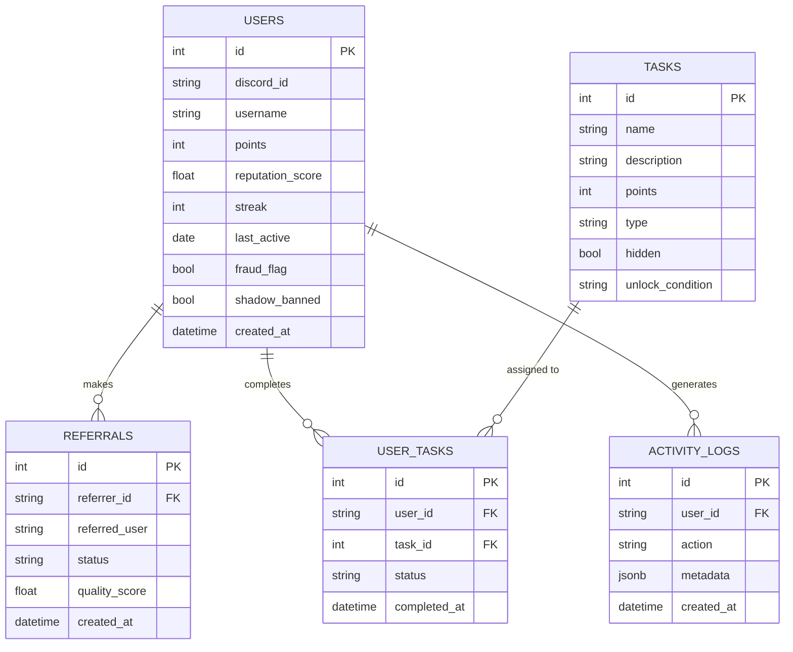

---

## Setup

### 1. Clone and install

```bash
git clone https://github.com/KaranMakani/EngageX.git
cd EngageX
poetry install
```

### 2. Configure environment

```bash
cp .env.example .env
# edit .env with your actual keys
```

### 3. Environment Variables

| Variable | Description |
|----------|------------|
| `DISCORD_TOKEN` | Your Discord bot token |
| `DATABASE_URL` | PostgreSQL connection string (asyncpg format) |
| `OPENAI_API_KEY` | OpenAI or OpenRouter API key |
| `OPENAI_BASE_URL` | API base URL (use OpenRouter URL if applicable) |
| `N8N_WEBHOOK_URL` | Your n8n instance URL |
| `APP_URL` | Your API URL (for n8n callbacks) |

### 4. Set up PostgreSQL on Railway

1. Create a new Railway project
2. Add a PostgreSQL service
3. Copy the `DATABASE_PUBLIC_URL` into your `.env`
4. Change the scheme from `postgresql://` to `postgresql+asyncpg://`

### 5. Deploy n8n on Railway

1. Add an n8n service to the same Railway project
2. Set environment variables for authentication
3. Import the workflow JSONs from `app/n8n/`

### 6. Run locally

```bash
# start the API + Discord bot
poetry run uvicorn app.main:app --reload
```

### 7. Deploy API to Railway (optional)

The Dockerfile supports an `API_ONLY=1` mode that runs the FastAPI server without the Discord bot. This is useful for Railway deployments where n8n needs to reach your API.

---

## Anti-Abuse Strategy

EngageX handles fraud silently — no public callouts, no drama:

- **Duplicate detection**: Identifies repeat referrals and content
- **Rate limiting**: Flags suspicious activity volumes
- **Behavior analysis**: Detects bot-like timing patterns
- **Silent penalties**: Shadow-banned users get reduced rewards without knowing
- **Reputation weighting**: Fraud signals tank your reputation score

---

## Gamification Loops

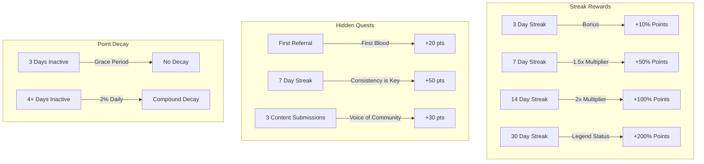

---

## Running Tests

```bash
poetry run pytest tests/ -v
```

27 tests covering scoring, streaks, fraud detection, reputation tiers, and hidden quest conditions.

---

## License

MIT
